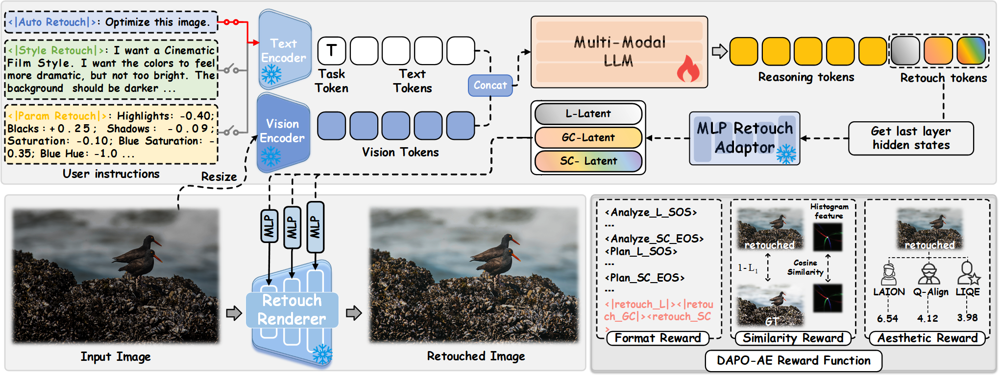

<div align="center">


<h1>VeraRetouch: A Lightweight Fully Differentiable Framework for Multi-Task Reasoning Photo Retouching</h1>

<div>
    <a href="https://Apollo-Yi.github.io" target="_blank">Yihong Guo</a><sup>1</sup>&emsp;
    <a href="https://youweilyu.github.io/" target="_blank">Youwei Lyu</a><sup>2</sup>&emsp;
    <a href="https://me.jeffreet.com/" target="_blank">Jiajun Tang</a><sup>2</sup>&emsp;
    <a href="https://github.com/OpenVeraTeam/VeraRetouch" target="_blank">Yizhuo Zhou</a><sup>1</sup>&emsp;
    <a href="https://github.com/OpenVeraTeam/VeraRetouch" target="_blank">Hongliang Wang</a><sup>3</sup>&emsp;
    <a href="https://scholar.google.com/citations?hl=zh-CN&user=Pcsml4oAAAAJ" target="_blank">Jinwei Chen</a><sup>2</sup>&emsp;
    <a href="https://scholar.google.com/citations?user=kj5HiGgAAAAJ&hl=en" target="_blank">Changqing Zou</a><sup>1†</sup>&emsp;
    <a href="https://fqnchina.github.io/" target="_blank">Qingnan Fan</a><sup>2</sup>
</div>
<div>
    <sup>1</sup>Zhejiang University, <sup>2</sup>vivo BlueImage Lab, <sup>3</sup>University of Chinese Academy of Sciences
</div>

&nbsp;&nbsp;<br>
<a href='https://arxiv.org/abs/2604.27375'></a> &nbsp;&nbsp;
<a href='https://apollo-yi.github.io/VeraRetouch/'></a> &nbsp;
</div> 

## 🗓️ To Do List
- [x] Release VeraRetouch inference code.
- [x] Release VeraRetouch model weights.
- [x] Release Retouch Encoder-Renderer inference code and weights.
- [ ] 🔴 Release iOS toy deployment.

## 🌟 Highlights
* 🔥 Lightweight design for controllable, interpretable mobile deployment.
* 🔥 Free-resolution input for flexible retouching across diverse image sizes.
* 🔥 Fully differentiable renderer for direct pixel-level training.
* 🔥 Unified support for auto, style, and parameter retouching.
* 🔥 AetherRetouch-1M+ for large-scale professional supervision.

<!-- <table>
<tr>
    <td></td>
    <td></td>
    <td></td>
</tr>
</table> -->
<table>
<tr>
    <td align="center">
        <br>
        <strong>Auto Mode</strong>
    </td>
    <td align="center">
        <br>
        <strong>Style Mode</strong>
    </td>
    <td align="center">
        <br>
        <strong>Param Mode</strong>
    </td>
</tr>
</table>
<p align="center">(Demo videos play at 3x speed)</p>

## 🎬 <a name="overview"></a>Overview



Reasoning photo retouching has gained significant traction, requiring models to analyze image defects, give reasoning processes, and execute precise retouching enhancements. However, existing approaches often rely on non-differentiable external software, creating optimization barriers and suffering from high parameter redundancy and limited generalization. To address these challenges, we propose VeraRetouch, a lightweight and fully differentiable framework for multi-task photo retouching. We employ a 0.5B Vision-Language Model (VLM) as the central intelligence to formulate retouching plans based on instructions and scene semantics. Furthermore, we develop a fully differentiable Retouch Renderer that replaces external tools, enabling direct end-to-end pixel-level training through decoupled control latents for lighting, global color, and specific color adjustments. To overcome data scarcity, we introduce AetherRetouch-1M+, the first million-scale dataset for professional retouching, constructed via a new inverse degradation workflow. Furthermore, we propose DAPO-AE, a reinforcement learning post-training strategy that enhances autonomous aesthetic cognition. Extensive experiments demonstrate that VeraRetouch achieves state-of-the-art performance across multiple benchmarks while maintaining a significantly smaller footprint, enabling mobile deployment.

## 🚀 Quick Start

### ⚙️ Environment
```bash
# Clone the repository
git clone https://github.com/OpenVeraTeam/VeraRetouch.git
cd VeraRetouch

# Create and activate conda environment
conda create -n vera-retouch python=3.10
conda activate vera-retouch
pip install -r requirements.txt
```

### ☕ Pretrained Model
Download our pretrained weights from [HuggingFace](https://huggingface.co/Gyh68/VeraRetouch/tree/main).

You can put the pretrained model to ./checkpoints

If you want to try "Reference Retouch" of Retouch Encoder-Renderer. please download Encoder-Renderer pretrained weights from [this HuggingFace link](https://huggingface.co/Gyh68/VeraRetouch.Encoder_Renderer/blob/main/encoder_renderer.pth).

### 🎨 VeraRetouch Inference
Our model supports three inference modes:

- Auto Retouch: Only an image is input.
```bash
python inference.py --mode auto \
                    --model-path ./checkpoints/VeraRetouch    # the pretrained model path \
                    --img_paths ./data_samples/input/sample_flower.jpg    # input image paths, multiple paths are supported \
                    --save_dir ./data_samples/output/    # output texts and images save path \
                    --chunk -1    # Enable when GPU memory is insufficient. The renderer will process large images in chunks. Recommended value: 262144 (512*512), enabling chunking will reduce inference speed. \
                    --batch_size 1    # Support batch inference
```
- Style Retouch: An image and user prompt are input.
```bash
python inference.py --mode style \
                    --prompt "I want a dreamy bright pink style."    # style user prompt(only 'style' mode used) \
                    --model-path ./checkpoints/VeraRetouch    # the pretrained model path \
                    --img_paths ./data_samples/input/sample_flower.jpg    # input image paths, multiple paths are supported \
                    --save_dir ./data_samples/output/    # output texts and images save path \
                    --chunk -1    # Enable when GPU memory is insufficient. The renderer will process large images in chunks. Recommended value: 262144 (512*512), enabling chunking will reduce inference speed. \
                    --batch_size 1    # Support batch inference
```
- Param Retouch: An image and retouching operator parameters are input.
```bash
python inference.py --mode style \
                    --instruction_path ./data_samples/param.json    # retourch operator parameters(only 'param' mode used) \
                    --model-path ./checkpoints/VeraRetouch    # the pretrained model path \
                    --img_paths ./data_samples/input/sample_flower.jpg    # input image paths, multiple paths are supported \
                    --save_dir ./data_samples/output/    # output texts and images save path \
                    --chunk -1    # Enable when GPU memory is insufficient. The renderer will process large images in chunks. Recommended value: 262144 (512*512), enabling chunking will reduce inference speed. \
                    --batch_size 1    # Support batch inference
```

### 🖥️ Retouch Encoder-Renderer Inference
The Retouch Encoder-Renderer enables image retouching with reference based on either a pair of retouching images or a single target retouching image.
- Reference-based retouching with a pair of retouching images
```bash
python infer_ref_retouch.py --pretrained_path ./checkpoints/encoder_renderer.pth    # Path to the pretrained model weights \
                            --output_dir ./data_samples/ref_outputs    # Directory to save the final retouched output images \
                            --ref_before_img_path ./data_samples/ref_inputs/ref/before.jpg   # File path of the original unretouched reference image \
                            --ref_after_img_path ./data_samples/ref_inputs/ref/after.jpg    # File path of the retouched reference target image \
                            --input_img_path ./data_samples/ref_inputs/sample.jpg    # File path of the input image to be retouched \
                            --chunk -1    # Enable when GPU memory is insufficient. The renderer will process large images in chunks. Recommended value: 262144 (512*512), enabling chunking will reduce inference speed. \
```
- Reference-based retouching with a single target retouching image (referencing the processing paradigm of paper [InstantRetouch: Personalized Image Retouching without Test-time Fine-tuning Using an Asymmetric Auto-Encoder](https://arxiv.org/abs/2602.17044): replace the pre-retouching image in the reference image pair with the input image)
```bash
python infer_ref_retouch.py --pretrained_path ./checkpoints/encoder_renderer.pth    # Path to the pretrained model weights \
                            --output_dir ./data_samples/ref_outputs    # Directory to save the final retouched output images \
                            --ref_before_img_path ./data_samples/ref_inputs/sample.jpg   # !!! Keep same with input_img_path.!!! \
                            --ref_after_img_path ./data_samples/ref_inputs/ref/after.jpg    # File path of the retouched reference target image \
                            --input_img_path ./data_samples/ref_inputs/sample.jpg    # File path of the input image to be retouched \
                            --chunk -1    # Enable when GPU memory is insufficient. The renderer will process large images in chunks. Recommended value: 262144 (512*512), enabling chunking will reduce inference speed. \
```

## 📲 Toy IOS depolyment
Comming soon...

## 📘 License
```
This repository is made available for non-commercial academic and research use only.

The materials are licensed under the Creative Commons Attribution-NonCommercial 4.0 International License (CC BY-NC 4.0). Redistribution and adaptation are permitted for non-commercial purposes with appropriate attribution.

Commercial use, including use in commercial products, services, or datasets, is not permitted.

See the [LICENSE](./LICENSE) file for details.
```

## <a name="citation"></a>🎓 Citation
```
@article{guo2026veraretouch,
  title={VeraRetouch: A Lightweight Fully Differentiable Framework for Multi-Task Reasoning Photo Retouching},
  author={Guo, Yihong and Lyu, Youwei and Tang, Jiajun and Zhou, Yizhuo and Wang, Hongliang and Chen, Jinwei and Zou, Changqing and Fan, Qingnan},
  journal={arXiv preprint arXiv:2604.27375},
  year={2026}
}
```
